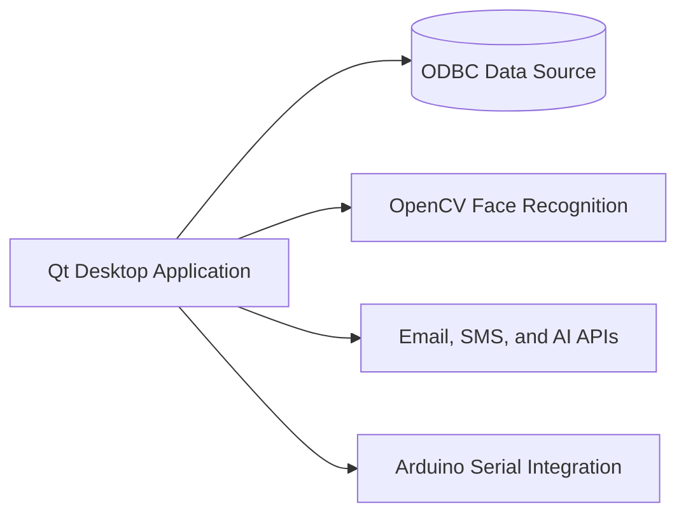

# Advisio Management System

Advisio is a C++ and Qt desktop application for training-center operations. It combines business modules such as clients, employees, trainings, meetings, and resources with reporting, computer-vision login, notifications, and Arduino-backed hardware workflows.

## Project Scope

- Authentication with credential-based login and face recognition
- CRUD flows across clients, employees, trainings, meetings, and resources
- PDF export, QR-code generation, statistics, and in-app notifications
- Email reminders and SMS notifications for operational workflows
- Arduino integration for a live waiting-room counter display
- AI-assisted features for chatbot and image-based resource analysis

## Architecture



## Stack

- C++17
- Qt 6.7.3 Widgets
- Qt Charts, Qt SQL, Qt Network, Qt PrintSupport, Qt SerialPort
- OpenCV
- ODBC via QODBC
- qmake and MinGW
- Arduino Uno integration

## Technical Highlights

- Multi-module desktop application with a unified Qt Widgets interface
- Role-aware operational workflows across several business domains
- OpenCV-based login path alongside standard credential authentication
- Reporting and visualization through PDF export and animated charts
- Hardware interaction through serial communication with Arduino devices

## Repository Layout

```text
core/       database connection, mail sender, notifications, shared helpers
managers/   business logic for clients, employees, trainings, meetings, resources
ui/         main window, charts, search, and Arduino-related UI components
dialog/     edit and update dialogs for domain entities
lib/        bundled QR-code generation library
```

## Build Requirements

- Qt 6.7.3 with Widgets, SQL, Network, Charts, PrintSupport, and SerialPort
- MinGW 64-bit toolchain
- OpenCV installation with face-recognition support
- ODBC data source configured for the application database
- Arduino drivers only if hardware-backed features are used

## Notes

- This repository is strongest as a desktop systems project that mixes application logic, reporting, computer vision, and hardware integration
- Some integrations depend on external services or local machine configuration, so setup is environment-specific
